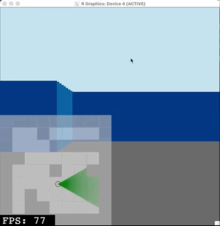

<!-- README.md is generated from README.Rmd. Please edit that file -->

```{r, include = FALSE}
knitr::opts_chunk$set(
  collapse = TRUE,
  comment = "#>",
  fig.path = "man/figures/README-",
  out.width = "100%"
)

library(eventloop)


#~~~~~~~~~~~~~~~~~~~~~~~~~~~~~~~~~~~~~~~~~~~~~~~~~~~~~~~~~~~~~~~~~~~~~~~~~~~~~
# Generate the pkgdown documentation
#~~~~~~~~~~~~~~~~~~~~~~~~~~~~~~~~~~~~~~~~~~~~~~~~~~~~~~~~~~~~~~~~~~~~~~~~~~~~~
if (FALSE) {
  pkgdown::build_site(override = list(destination = "../coolbutuseless.github.io/package/eventloop"))
}
```

# eventloop

<!-- badges: start -->

<!-- badges: end -->

`eventloop` provides a framework for rendering interactive events to an
R graphics device at speeds fast enough to be considered interesting for
games and other 'realtime' animated possiblilities.


## ToDo before release:

* Introductory vignettes
    * Small concepts
* A reference vignette showing all the values that are passed to the 
  core function
* Tidy Vignettes
    * Consistent documentation across all examples. i.e. same headings
* New vignettes:
    * Using an R6 object to manage the state rathen than having global vars
    * Wordle(?)
* Dual licensed MIT and GPL3
* Standard note on why the vignettes only link to mp4
    * Since an interactive app can't be captured within a vignette, a video 
      screen capture has been included with this vignette.
* Be able to set the initial canvas colour
* Throw an error if system == windows
    "Windows does not support a device with an 'onIdle' callback which 
     is necessary to use the eventloop package"

## EventLoop: an interactive graphical programming "system/process/paradigm?" for R

* R is great
* The story for interactive applications is unexplored.
* Interactive apps are curently possible, but often you're handing over your 
  session to javascript and writing html/css/js! e.g. plotly and shiny
* I was after a fast, reactive graphical interface that used only R code
  but still takes care of the infrastructure needed for interactivity
  e.g. framerate control, event capturing etc.

Next Slide:

* Let's face it, I wanted to write/play games and puzzles in R (like
ever computer system I've owned)

Cover shot: Creepy computer games, Usborne publishing.


## Game engines in R

* It is possible:
    * someone has a gmae of tictactoe
    * I created a text only 2048.
    * someone must have created a graphical one?

## What I needed was a system that would make writing these things easy.

I needed an event loop in R

## What is an Event Loop?

An event loop (or 'game loop', or 'interactive loop') is a programming pattern
where the system processes user input, but does other duties while waiting for that input.

[gameprogrammingpatterns.com](https://www.gameprogrammingpatterns.com/game-loop.html) 
defines a game loop as follows:

    A game loop runs continuously during gameplay. Each turn of the loop, it 
    processes user input without blocking, updates the game state, and renders 
    the game. It tracks the passage of time to control the rate of gameplay.


When used in games, the game loop updates the world, moves spaceships, spawns
greeblies.  When the user gives input (e.g. pressing the 'jump' button), the
system handles that user input - while also taking time to keep updating the
greeblies and spaceshipts etc.

## Contrast this with a purely reactive system

* System waits for input
* Reacts to button press
* Return to step 1

## Concept of a "world state" that gets updated every tick of the clock

Gigantic clockwork machine.

User controls one tiny bit of the input (even if it's only to hit ESC to 
terminate the world)


## Where might you witness a game loop?

* Video games
    * Is the user doing anything?
    * Yes! - start doing what the user asked
    * Regardless of what the user is doing, update the spaceships and greelibes,
      play the next mustical note of the tune, scroll the screen 1-pixel sideways.
* Interactive applications e.g. VLC video player.
    * Is the user doing anything?
    * Yes! Change volume, increase brightness. Do what the user requested.
    * Regardless of what the user requested decode the next frame of video and
      display it on the screen
      
* Include a couple of flow diagrams/decision trees to illustrate the concept.      
      
      
## Where can you find event loops in R?

Currently 'shiny' may be the the most common R frameworks for development of interactive programs.  It is a powerful framework which taps into a "reactive web application" 
mode of operations - which all has a few too many layers of abstraction
to be fast.

In the wider programming world, [`processing`](https://processing.org/) is a great example of an accessible
game programming loop that uses a domain specific interaction language (built
upon a Java backend).

## What's needed for a successful event loop?  (And how do we achieve them in R?)

The core of this presentation: how do we get each of these tings in R?

* Fast display - draw quickly
* non-blocking events 
* do game processing while idle
* low overhead drawing device i.e. no state kept in the drawing buffer that 
  needs to be managed, added to, freed etc
* double buffering
* FPS control 
* Fast code!
* Global State


## Fast displays

* Show timing for 2 benchmarks
    * Display an image as fast as possible
    * Display a nativeraster as fast as possible.
    
Speed Conclusions:
    * For an x11 device in 'cairo', nativeraster is faaast.
    * For window 'nativeraster' isn't an advantage. 
    * Show some raw FPS numbers here
    * Show data on all of the following: 
        * Windows, Quartz, X11 (cairo/nbcairo/dbcairo) 
        nativeraster, raster

    
## Speed2: Devices and 'displaylists'

* What are displaylists? Capture a list of all rendering commands
* Most often seen when re-sizing a window - display list gets re-run.
* See the effect of displaylists if we turn them off and try some of our usual things
* When rendering at 30fps for a long time, that's going to be a lot of junk 
  in the displaylist that you never ever need.
* how to turn it off    

## Note on new.page()

grid.newpage() does a lot of work.

But since I have displaylists turned off, just paint over everything with 
a white rectangle rather than call 'newpage()'


## Discussion on 'callbacks'

* graphcs devices in R may suport them to monitor for events.
* without 'onIdle' there's a way to react when an event happens, 
  but if the user isn't doing anything, then no callback gets called!
  which means the world state depends totally on the user, and never 
  acts independently!

## Events supported by R graphics devices

| device    | type             | mouse down | mouse move | mouse up | keyboard | double buffered | canGenIdle |
|-----------|------------------|------------|------------|----------|----------|-----------------|------------|
| quartz    |                  | no         | no         | no       | no       | ???             | no         |
| windows   |                  | yes        | yes        | yes      | yes      | ???             | no         |
| RStudioGD |                  | no         | no         | no       | no       | ???             | no         |
| x11       | type = 'Xlib'    | yes        | yes        | yes      | yes      | no              | yes        |
| x11       | type = 'cairo'   | yes        | yes        | yes      | yes      | no              | yes        |
| x11       | type = 'nbcairo' | yes        | yes        | yes      | yes      | no              | yes        |
| x11       | type = 'dbcairo' | yes        | yes        | yes      | yes      | yes             | yes        |


## canGenOnIdle is the key

* Have the computer run a function while waiting for input!


## Double buffering

* Screen tearing
* idle func can run much faster than the display can update!
* weird mismatch means tearing as the screen is only partially drawn by R when
  the display system wants to put something on the screen!
* Can probably capture this from a live screen in a gif?
* x11 type = dbcairo
* dev.hold()/dev.flush()  (thanks to Michael Sumner for the tip)


## FPS governor

If we let the idle loop run as fast as possible, it's possibly gonig to 
run too fast!

Greeblies/enemy spaceships updating at 100 times a second could get difficult
to show on screen in a consistent manner.

So put a governor on the FPS to try and only run our core function at 30fps
(or whatever).

If it runs slower than 30fps, then there's no need to try and limit the speed.

If it runs faster than 30fps, then introduce little pauses each loop to 
control the overall rate.

Problem: you can't use `Sys.sleep()` in an event loop!

Solution: short bit of C code to help govern the call rate.


## Fast code

* Say 'no' to nested for loops.
* Vectorize vectorize vectorize!

## Global State

* Set things in the parent environment with "<<-"
    * Usually a bit of code smell!
* The graphics device is a dumb canvas that gets cleared and drawn every frame.
* R functions don't have any idea of C's static variables
* For user functions, store global variables in the outer code.
* For framework variables, theses are injected into the function environment
  prior to each call.
    * Probably a better way to do this sanely, but it works OK for now  (This 
      was almost the title for this talk)

## Global State (Nicer)

* A nicer way of managing state might be to use environments or an R6
  object
* Not attempted here.


## Put it all together

* Initialise a fast graphics device with double buffering: x11 with 'dbcairo'
* Disable antialiasing, disable displaylist
* Setup event handlers for keys + mouse
    * information about events is stored in an environment
* Use the users supplied function as part of the onIdle callback
* The actual onIdle callback
    * updates frame number
    * calculates FPS over last N frames
    * gets any events from the keyboard and mouse and adds them as variables
      in the environment of the user's function
    * calls the users callback function
    * adds a delay (if necessary) to keep to the required FPS
    
Insert here an animated or multi-page schematic showing the state of the system,
what happens when a user presses a key


## The event loop mindset

* Have some global variables to retain state
* Recalculate the world
* Clear the device
* Draw the world

"Fun" effects can be had by not clearing the device every time i.e. trippy

## Examples 

Show captured mp4s of these.  Too risky to do live!

* Starfield
* Game of life
* Asteroids
* raycaster engine


## Tips

* `ggplot2` is a great package, but because of the all the layout and scaling that 
   goes into one of its great-looking plots, it's not speedy.
* Instead just do raw `grid::grid.points()` etc calls.
* Avoid `grid.newpage()`it does a lot more than clear the page.
    * instead just draw a giant rectangle to cover the screen.


## Issues

* Only the real `x11()` device on a unix or macOS system has the `onIdle`
  mechanism to make this work.
* There is an `x11()` on windows but it is just a wrapper around `windows()` device.
* Sometimes the device gets locked in a slow state on macOS.  I am unsure on 
  why this happens, but when it does I need to logout-then-login to 
  return to the high-speed state.
* Not tested with non-square device sizes

## Future for interactive apps in R

* Campaign for `onIdle` to be added to `windows()` and `quartz()` devices.
* Campaign for keyboard, mouse + idle events for quartz()
    * quartz may be quite legacy + bomb-proof
    * is there need for a new device for modern macs?
* Remove "switch to busy pointer" when doing double buffering hold/flush in x11()
* Mouse button presses, but no mouse wheel (as far as i can tell)

## Installation

You can install from [GitHub](https://github.com/coolbutuseless/eventloop) with:

``` r
# install.package('remotes')
remotes::install_github('coolbutuseless/eventloop')
```


## Example - Basic Drawing app

The following is a basic interactive example.

```{eval = FALSE}
library(grid)
library(eventloop)

#~~~~~~~~~~~~~~~~~~~~~~~~~~~~~~~~~~~~~~~~~~~~~~~~~~~~~~~~~~~~~~~~~~~~~~~~~~~~~
# Set up the global variables which store the state of the world
#  'drawing'  Currently drawing?
#~~~~~~~~~~~~~~~~~~~~~~~~~~~~~~~~~~~~~~~~~~~~~~~~~~~~~~~~~~~~~~~~~~~~~~~~~~~~~
drawing <- FALSE

#~~~~~~~~~~~~~~~~~~~~~~~~~~~~~~~~~~~~~~~~~~~~~~~~~~~~~~~~~~~~~~~~~~~~~~~~~~~~~
# The main 'draw' function - his function is called repeatedly within the eventloop.
#
# If 'event' is not NULL, then it means that the user interacted with the
# display.  The following events have an effect on the canvas:
#  - hold mouse to set drawing mode
#  - releasing the mouse button stops drawing mode
#  - pressing SPACE clears the canvas
#~~~~~~~~~~~~~~~~~~~~~~~~~~~~~~~~~~~~~~~~~~~~~~~~~~~~~~~~~~~~~~~~~~~~~~~~~~~~~
draw <- function(event, mouse_x, mouse_y, ...) {
  
  #~~~~~~~~~~~~~~~~~~~~~~~~~~~~~~~~~~~~~~~~~~~~~~~~~~~~~~~~~~~~~~~~~~~~~~~~~~~
  # Process events
  #~~~~~~~~~~~~~~~~~~~~~~~~~~~~~~~~~~~~~~~~~~~~~~~~~~~~~~~~~~~~~~~~~~~~~~~~~~~
  if (!is.null(event)) {
    if (event$type == 'mouse_down') {
      drawing <<- TRUE
    } else if (event$type == 'mouse_up') {
      drawing <<- FALSE
    } else if (event$type == 'key_press' && event$char == ' ') {
      grid::grid.rect(gp = gpar(col=NA, fill='white')) # clear screen
    }
  }
  
  #~~~~~~~~~~~~~~~~~~~~~~~~~~~~~~~~~~~~~~~~~~~~~~~~~~~~~~~~~~~~~~~~~~~~~~~~~~~
  # If the pen is currently active, then draw on the canvas and display
  # the latest version.
  # Note that graphics coordiates are from bottom-left of screen, while
  # matrix coordinates are from top-left.  So the y-axis must be inverted
  # to set a matrix location from a mouse position
  #~~~~~~~~~~~~~~~~~~~~~~~~~~~~~~~~~~~~~~~~~~~~~~~~~~~~~~~~~~~~~~~~~~~~~~~~~~~
  if (drawing) {
    grid::grid.circle(
      x = mouse_x, 
      y = mouse_y,
      r = unit(5, 'pt'),
      gp = gpar(fill='black')
    )
  }
  
  
}


#~~~~~~~~~~~~~~~~~~~~~~~~~~~~~~~~~~~~~~~~~~~~~~~~~~~~~~~~~~~~~~~~~~~~~~~~~~~~~
# Start the event loop.  
# Press ESC to quit
#~~~~~~~~~~~~~~~~~~~~~~~~~~~~~~~~~~~~~~~~~~~~~~~~~~~~~~~~~~~~~~~~~~~~~~~~~~~~~
eventloop::run_loop(draw, double_buffer = FALSE)
```


## Example - Raycaster

See [vignette](https://coolbutuseless.github.io/package/eventloop/articles/raycaster.html) for code for this example.




## Related Software


## Acknowledgements

* R Core for developing and maintaining the language.
* CRAN maintainers, for patiently shepherding packages onto CRAN and maintaining
  the repository
