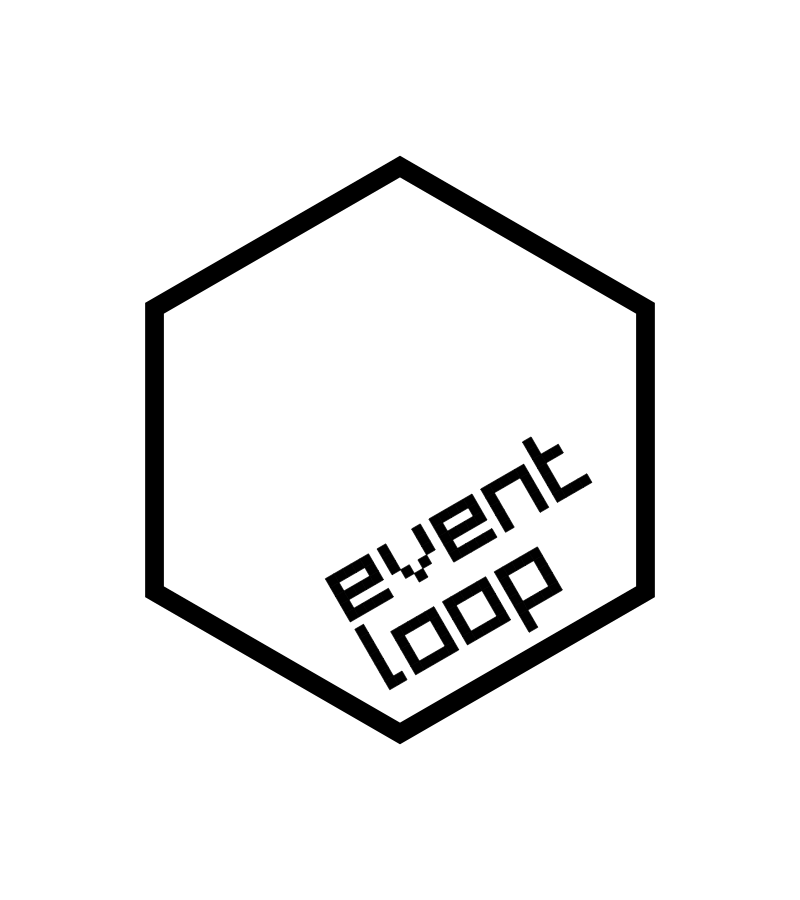
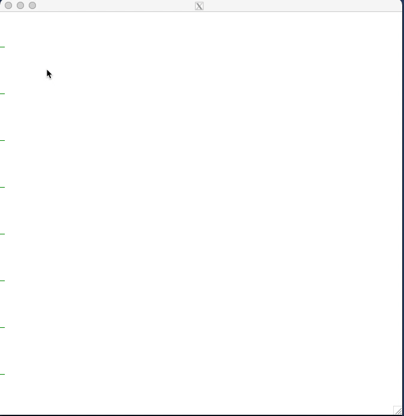

<!-- README.md is generated from README.Rmd. Please edit that file -->

```{r, include = FALSE}
knitr::opts_chunk$set(
  collapse = TRUE,
  comment = "#>",
  fig.path = "man/figures/README-",
  out.width = "100%"
)

library(eventloop)


#~~~~~~~~~~~~~~~~~~~~~~~~~~~~~~~~~~~~~~~~~~~~~~~~~~~~~~~~~~~~~~~~~~~~~~~~~~~~~
# Generate the pkgdown documentation
#~~~~~~~~~~~~~~~~~~~~~~~~~~~~~~~~~~~~~~~~~~~~~~~~~~~~~~~~~~~~~~~~~~~~~~~~~~~~~
if (FALSE) {
  pkgdown::build_site(override = list(destination = "../coolbutuseless.github.io/package/eventloop"))
}
```

# eventloop 

<!-- badges: start -->

<!-- badges: end -->

The `{eventloop}` package provides a framework for rendering interactive graphics 
and handling mouse+keyboard events from the user at speeds fast enough to be 
considered interesting for games and other realtime applications.

[gameprogrammingpatterns.com](https://www.gameprogrammingpatterns.com/game-loop.html) 
defines an event loop (also known as a *game loop*) as follows:

    A game loop runs continuously during gameplay. Each turn of the loop, it 
    processes user input without blocking, updates the game state, and renders 
    the game. It tracks the passage of time to control the rate of gameplay.


The `{eventloop}` package takes care of monitoring for keyboard+mouse events, 
and the user supplies another function to determine what happens with that input,
and what gets drawn to the screen.


#### NOTE: Windows does not support the device features needed to use this package

Only the `x11()` device on macOS and *nix platforms includes the support
for events which are necessary for `eventloop` to work.

This package does *not* work on windows.


#### Overview of Process

* The user defines a callback function that is run repeatedly by the system.
* If a user interaction has happened within the graphics device, then the
  `event` variable (passed to the callback function) will be non-NULL and 
  contain details of the event.
* The user may choose to handle some, none or all different event types in 
  order to change the state of some global variables.
* The user may also choose what new things (if any) are drawn to the graphics
  device each time the function is called.
  
#### Tips

* If your screen only updates sporadically (e.g. a chess game), then it could
  be appropriate to set `double_buffer = FALSE` to avoid the mouse pointer 
  flickering.
* For fast screen updates, set `double_buffer = TRUE`.  This will (unavoidably) 
  cause the mouse pointer to flicker, but overall the updates will be smoother.
* Set a limit on how often your function gets called by setting `fps_target = [integer]`
  to be the number of times to call this function every second (if this frame rate is 
  possible to achieve).
* To run your function as fast as possible, set `fps_target = NA`


## ToDo before release:

* Re-add 'mouse-move' to documentation for events


## List of Vignettes with a brief description

#### Illustrative Examples

* [Verbose illustrative example](https://coolbutuseless.github.io/package/eventloop/articles/aa-event-reference-global.html)
* [Verbose illustrative example using R6 to store global state](https://coolbutuseless.github.io/package/eventloop/articles/aa-event-reference-r6.html)

#### Basic Drawing Apps

* [Grid-based drawing](https://coolbutuseless.github.io/package/eventloop/articles/ba-basic-canvas-grid.html)
* [Point-based drawing](https://coolbutuseless.github.io/package/eventloop/articles/ba-basic-canvas-rough.html)
* [Line-based drawing](https://coolbutuseless.github.io/package/eventloop/articles/ba-basic-canvas-smooth.html)

#### Easy applications

* [Streaming plot data](https://coolbutuseless.github.io/package/eventloop/articles/ba-plotting.html)
* [Game of Life](https://coolbutuseless.github.io/package/eventloop/articles/ca-game-of-life.html)

#### Medium complextiy applications

* [Reactive objects](https://coolbutuseless.github.io/package/eventloop/articles/ca-reactive-objects.html)
* [Spirograph](https://coolbutuseless.github.io/package/eventloop/articles/ca-spirograph.html)
* [Animated Starfield](https://coolbutuseless.github.io/package/eventloop/articles/ca-starfield.html)


#### Complex Puzzles + Games

* [Asteroids](https://coolbutuseless.github.io/package/eventloop/articles/3da-asteroids.html)
* [Physics Simulation](https://coolbutuseless.github.io/package/eventloop/articles/da-physics-sim.html)
* [Raycast 'Wolfenstein' 3d engine](https://coolbutuseless.github.io/package/eventloop/articles/da-raycaster.html)
* ['Unruly' Puzzle](https://coolbutuseless.github.io/package/eventloop/articles/da-unruly.html)
* [Wordle](https://coolbutuseless.github.io/package/eventloop/articles/da-wordle.html)


## Installation 

``` r
# install.package('remotes')
remotes::install_github('coolbutuseless/eventloop')
```


## Example - Basic Drawing app

The following is a basic application which allows the user to draw lines 
with the mouse.

Every time the callback function (`draw()`) is executed from within the event loop, 
it draws a line from the last mouse position to the current mouse position.

The position of the mouse during the previous call is saved manually using global variables. 

A boolean variable (`drawing`) is used to note whether the mouse button 
is currently pressed or not.  Changes to the screen only happend if `drawing == TRUE`.

```{eval = FALSE}
library(grid)
library(eventloop)

#~~~~~~~~~~~~~~~~~~~~~~~~~~~~~~~~~~~~~~~~~~~~~~~~~~~~~~~~~~~~~~~~~~~~~~~~~~~~~
# Set up the global variables which store the state of the world
#  'drawing' = Is the mouse button currently pressed?
#  last_x/last_y  = the last mouse position is manually saved every time
#                 the callback function runs.
#~~~~~~~~~~~~~~~~~~~~~~~~~~~~~~~~~~~~~~~~~~~~~~~~~~~~~~~~~~~~~~~~~~~~~~~~~~~~~
drawing <- FALSE
last_x  <- NA
last_y  <- NA

#~~~~~~~~~~~~~~~~~~~~~~~~~~~~~~~~~~~~~~~~~~~~~~~~~~~~~~~~~~~~~~~~~~~~~~~~~~~~~
#' Callback function - 'draw()' 
#'
#' If 'event' is not NULL, then it means that the user interacted with the
#' display.  
#' 
#' The following events are handled by this callback:
#'  - hold mouse to set drawing mode
#'  - releasing the mouse button stops drawing mode
#'  - pressing SPACE clears the canvas
#'  
#' Press ESC to quit.
#' 
#' @param event The event from the graphics device. Is NULL when no event
#'        occurred.  Otherwise has `type` element set to:
#'        `event$type = 'mouse_down'` 
#'               - an event in which a mouse button was pressed
#'               - `event$button` gives the index of the button
#'        `event$type = 'mouse_up'`   
#'               - a mouse button was released
#'        `event$type = 'mouse_move'`   
#'               - mouse was moved 
#'        `event$type = 'key_press'`  
#'               - a key was pressed
#'               - `event$char` holds the character as string
#'               - `event$int` holds the integer representation
#' @param mouse_x,mouse_y current location of mouse within window. If mouse is 
#'        not within window, this will be set to the last available coordinates
#' @param frame_num integer count of which frame this is
#' @param fps_actual,fps_target the curent framerate and the framerate specified
#'        by the user
#' @param dev_width,dev_height the width and height of the output device. Note:
#'        this does not cope well if you resize the window
#' @param ... any extra arguments ignored
#~~~~~~~~~~~~~~~~~~~~~~~~~~~~~~~~~~~~~~~~~~~~~~~~~~~~~~~~~~~~~~~~~~~~~~~~~~~~~
draw <- function(event, mouse_x, mouse_y, ...) {
  
  #~~~~~~~~~~~~~~~~~~~~~~~~~~~~~~~~~~~~~~~~~~~~~~~~~~~~~~~~~~~~~~~~~~~~~~~~~~~
  # Process events
  #~~~~~~~~~~~~~~~~~~~~~~~~~~~~~~~~~~~~~~~~~~~~~~~~~~~~~~~~~~~~~~~~~~~~~~~~~~~
  if (!is.null(event)) {
    if (event$type == 'mouse_down') {
      drawing <<- TRUE
    } else if (event$type == 'mouse_up') {
      drawing <<- FALSE
      last_x  <<- NA
      last_y  <<- NA
    } else if (event$type == 'key_press' && event$char == ' ') {
      grid::grid.rect(gp = gpar(col=NA, fill='white')) # clear screen
    }
  }
  
  #~~~~~~~~~~~~~~~~~~~~~~~~~~~~~~~~~~~~~~~~~~~~~~~~~~~~~~~~~~~~~~~~~~~~~~~~~~~
  # If 'drawing' is currently TRUE, then draw a line from last known 
  # coordinates to current mouse coordinates
  #~~~~~~~~~~~~~~~~~~~~~~~~~~~~~~~~~~~~~~~~~~~~~~~~~~~~~~~~~~~~~~~~~~~~~~~~~~~
  if (drawing) {
    if (!is.na(last_x)) {
      grid::grid.lines(
        x = c(last_x, mouse_x),
        y = c(last_y, mouse_y),
        gp = gpar(col = 'black')
      )
    }
    
    # Keep track of where the mouse was for the next time we draw
    last_x <<- mouse_x
    last_y <<- mouse_y
  }
}


#~~~~~~~~~~~~~~~~~~~~~~~~~~~~~~~~~~~~~~~~~~~~~~~~~~~~~~~~~~~~~~~~~~~~~~~~~~~~~
# Start the event loop. Press ESC to quit.
#~~~~~~~~~~~~~~~~~~~~~~~~~~~~~~~~~~~~~~~~~~~~~~~~~~~~~~~~~~~~~~~~~~~~~~~~~~~~~
eventloop::run_loop(draw, fps_target = NA, double_buffer = TRUE)
```




## Example - Raycaster

If the code in your callback function can run fast enough in R, 
then you can do some more complex rendering.

Here's a simple raycaster in plain R.

See [vignette](https://coolbutuseless.github.io/package/eventloop/articles/raycaster.html) for code for this example.


## Related Software

* tcl/tk
* other GUI toolkits
* shiny
* documentation for `grid.locate()`

## Acknowledgements

* R Core for developing and maintaining the language.
* CRAN maintainers, for patiently shepherding packages onto CRAN and maintaining
  the repository
