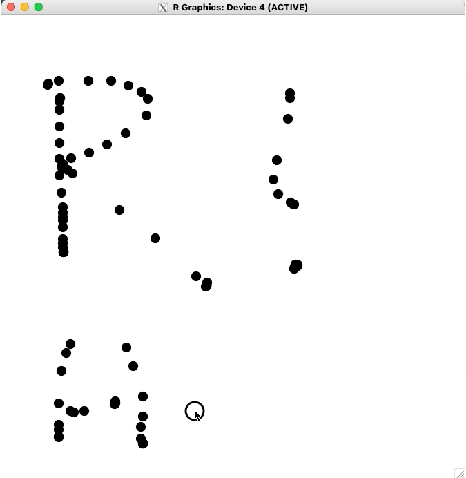

<!-- README.md is generated from README.Rmd. Please edit that file -->

```{r, include = FALSE}
knitr::opts_chunk$set(
  collapse = TRUE,
  comment = "#>",
  fig.path = "man/figures/README-",
  out.width = "100%"
)

library(dplyr)
library(eventloop)


#~~~~~~~~~~~~~~~~~~~~~~~~~~~~~~~~~~~~~~~~~~~~~~~~~~~~~~~~~~~~~~~~~~~~~~~~~~~~~
# Generate the pkgdown documentation
#~~~~~~~~~~~~~~~~~~~~~~~~~~~~~~~~~~~~~~~~~~~~~~~~~~~~~~~~~~~~~~~~~~~~~~~~~~~~~
if (FALSE) {
  pkgdown::build_site(override = list(destination = "../coolbutuseless.github.io/package/eventloop"))
}
```

# eventloop 

<!-- badges: start -->


<!-- badges: end -->

The `{eventloop}` package provides a framework for rendering interactive graphics 
and handling mouse+keyboard events from the user at speeds fast enough to be 
considered interesting for games and other realtime applications.


The `{eventloop}` package takes care of setting up an `x11()` window  with 
monitoring for keyboard+mouse events.  In every spare moment, a 
user-defined function will be called with the latest event details.   Within
this function the user can process events and update the display.


## Supported Platforms

```{r echo=FALSE}
dplyr::tibble(
  System = c('macOS', '*nix', 'windows'),
  "x11() device has 'onIdle()' event callback" = c('Yes', 'Yes', 'No'),
  "Supported in {eventloop}" = c('✅Yes', '✅Yes', '❌ No')
 ) %>%
  knitr::kable()
```

Notes:

* windows `x11()` device does not support `onIdle` callback and hence this 
  package does not work on windows
* macOS `x11()` support via [Xquartz](https://www.xquartz.org/) may slow to 
  a crawl after running for a while.  You will need to logout-and-log-back in, 
  or restart your machine to regain full speed.   This is an R/Xquartz bug, 
  but I'm not sure where exactly.


## Installation 

``` r
# install.package('remotes')
remotes::install_github('coolbutuseless/eventloop')
```


## Example - Basic Drawing app

This is a basic application which lets the user draw in 
a window using the mouse.


```{r, eval = FALSE}
library(grid)
library(eventloop)

#~~~~~~~~~~~~~~~~~~~~~~~~~~~~~~~~~~~~~~~~~~~~~~~~~~~~~~~~~~~~~~~~~~~~~~~~~~~~~
# Set up the global variables which store the state of the world
#  'drawing'      = Is the mouse button currently pressed?
#  last_x/last_y  = the last mouse position is manually saved every time
#                 the callback function runs.
#
# These values will be updated manually by the user in the `draw()` function
#~~~~~~~~~~~~~~~~~~~~~~~~~~~~~~~~~~~~~~~~~~~~~~~~~~~~~~~~~~~~~~~~~~~~~~~~~~~~~
drawing <- FALSE
last_x  <- NA
last_y  <- NA

#~~~~~~~~~~~~~~~~~~~~~~~~~~~~~~~~~~~~~~~~~~~~~~~~~~~~~~~~~~~~~~~~~~~~~~~~~~~~~
#' Callback function - 'draw()' 
#'
#' If 'event' is not NULL, then it means that the user interacted with the
#' display.  
#' 
#' The following events are handled by this callback:
#'  - hold mouse to set drawing mode
#'  - releasing the mouse button stops drawing mode
#'  - pressing SPACE clears the canvas
#'  
#' Press ESC to quit.
#' 
#' @param event The event from the graphics device. Is NULL when no event
#'        occurred.  Otherwise has `type` element set to:
#'        `event$type = 'mouse_down'` 
#'               - an event in which a mouse button was pressed
#'               - `event$button` gives the index of the button
#'        `event$type = 'mouse_up'`   
#'               - a mouse button was released
#'        `event$type = 'mouse_move'`   
#'               - mouse was moved 
#'        `event$type = 'key_press'`  
#'               - a key was pressed
#'               - `event$char` holds the character as string
#'               - `event$int` holds the integer representation
#' @param mouse_x,mouse_y current location of mouse within window. If mouse is 
#'        not within window, this will be set to the last available coordinates
#' @param frame_num integer count of which frame this is
#' @param fps_actual,fps_target the curent framerate and the framerate specified
#'        by the user
#' @param dev_width,dev_height the width and height of the output device. Note:
#'        this does not cope well if you resize the window
#' @param ... any extra arguments ignored
#~~~~~~~~~~~~~~~~~~~~~~~~~~~~~~~~~~~~~~~~~~~~~~~~~~~~~~~~~~~~~~~~~~~~~~~~~~~~~
draw <- function(event, mouse_x, mouse_y, ...) {
  
  #~~~~~~~~~~~~~~~~~~~~~~~~~~~~~~~~~~~~~~~~~~~~~~~~~~~~~~~~~~~~~~~~~~~~~~~~~~~
  # Process events
  #~~~~~~~~~~~~~~~~~~~~~~~~~~~~~~~~~~~~~~~~~~~~~~~~~~~~~~~~~~~~~~~~~~~~~~~~~~~
  if (!is.null(event)) {
    if (event$type == 'mouse_down') {
      drawing <<- TRUE
    } else if (event$type == 'mouse_up') {
      drawing <<- FALSE
      last_x  <<- NA
      last_y  <<- NA
    } else if (event$type == 'key_press' && event$char == ' ') {
      grid::grid.rect(gp = gpar(col=NA, fill='white')) # clear screen
    }
  }
  
  #~~~~~~~~~~~~~~~~~~~~~~~~~~~~~~~~~~~~~~~~~~~~~~~~~~~~~~~~~~~~~~~~~~~~~~~~~~~
  # If 'drawing' is currently TRUE, then draw a line from last known 
  # coordinates to current mouse coordinates
  #~~~~~~~~~~~~~~~~~~~~~~~~~~~~~~~~~~~~~~~~~~~~~~~~~~~~~~~~~~~~~~~~~~~~~~~~~~~
  if (drawing) {
    if (!is.na(last_x)) {
      grid::grid.lines(
        x = c(last_x, mouse_x),
        y = c(last_y, mouse_y),
        gp = gpar(col = 'black')
      )
    }
    
    # Keep track of where the mouse was for the next time we draw
    last_x <<- mouse_x
    last_y <<- mouse_y
  }
}


#~~~~~~~~~~~~~~~~~~~~~~~~~~~~~~~~~~~~~~~~~~~~~~~~~~~~~~~~~~~~~~~~~~~~~~~~~~~~~
# Start the event loop. Press ESC to quit.
#~~~~~~~~~~~~~~~~~~~~~~~~~~~~~~~~~~~~~~~~~~~~~~~~~~~~~~~~~~~~~~~~~~~~~~~~~~~~~
eventloop::run_loop(draw, fps_target = NA, double_buffer = TRUE)
```


Notes:

* Every time the callback function (`draw()`) is executed from within the event loop,  it draws a line from the last mouse position to the current mouse position.
* The position of the mouse during the previous call is saved manually using global variables. 
* A boolean variable (`drawing`) is used to note whether the mouse button 
is currently pressed or not.  Changes to the screen only happend if `drawing == TRUE`.


## Gallery of Puzzles, Games + Applications implemented in the vignettes

**Click an image to view the code/vignette**

#### Illustrative Verbose Examples

|  |  |
|---|---|
| [Verbose illustrative example](https://coolbutuseless.github.io/package/eventloop/articles/aa-event-reference-global.html) | [Verbose illustrative example using R6 to store global state](https://coolbutuseless.github.io/package/eventloop/articles/aa-event-reference-r6.html) |
| [Grid-based drawing](https://coolbutuseless.github.io/package/eventloop/articles/ba-basic-canvas-grid.html)  <br/> | [Point-based drawing](https://coolbutuseless.github.io/package/eventloop/articles/ba-basic-canvas-rough.html)  <br/> |
| [Line-based drawing](https://coolbutuseless.github.io/package/eventloop/articles/ba-basic-canvas-smooth.html)  <br/> |  |
| [Streaming plot data](https://coolbutuseless.github.io/package/eventloop/articles/ba-plotting.html) | [Game of Life](https://coolbutuseless.github.io/package/eventloop/articles/ca-game-of-life.html) |
| [Reactive objects](https://coolbutuseless.github.io/package/eventloop/articles/ca-reactive-objects.html) | [Spirograph](https://coolbutuseless.github.io/package/eventloop/articles/ca-spirograph.html) |
| [Animated Starfield](https://coolbutuseless.github.io/package/eventloop/articles/ca-starfield.html) |  |
| [Asteroids](https://coolbutuseless.github.io/package/eventloop/articles/3da-asteroids.html) | [Physics Simulation](https://coolbutuseless.github.io/package/eventloop/articles/da-physics-sim.html) |
| [Raycast 'Wolfenstein' 3d engine](https://coolbutuseless.github.io/package/eventloop/articles/da-raycaster.html) | ['Unruly' Puzzle](https://coolbutuseless.github.io/package/eventloop/articles/da-unruly.html) |
| [Wordle](https://coolbutuseless.github.io/package/eventloop/articles/da-wordle.html) |  |


## Tech bits: What is an event loop?


[gameprogrammingpatterns.com](https://www.gameprogrammingpatterns.com/game-loop.html) 
defines an event loop (also known as a *game loop*) as follows:

    A game loop runs continuously during gameplay. Each turn of the loop, it 
    processes user input without blocking, updates the game state, and renders 
    the game. It tracks the passage of time to control the rate of gameplay.

## Tech bits: How is the event loop implemented in R?

Graphics windows in R can have *event handlers* attached which instruct the
device to run a function when a certain event occurs.

When a mouse or keyboard event occurs, `{eventloop}` stores the event in 
an environment for later access.

When there is no event occuring, another function is called continuously.  This
function is the *'onIdle' event callback* and is only available in the `x11()` 
device on macOS and *nix.

The `{eventloop}` package orchestrates the events and window information into
arguments to the user-supplied 'onIdle' function - calling this function over and over
while the event loop is running.


## Related Software

* tcl/tk
* other GUI toolkits
* shiny
* documentation for `grid.locate()`

## Acknowledgements

* R Core for developing and maintaining the language.
* CRAN maintainers, for patiently shepherding packages onto CRAN and maintaining
  the repository
