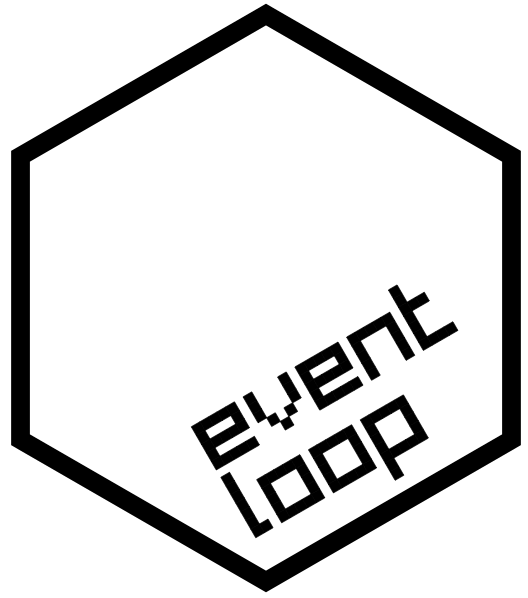

<!-- README.md is generated from README.Rmd. Please edit that file -->

```{r, include = FALSE}
knitr::opts_chunk$set(
  collapse = TRUE,
  comment = "#>",
  fig.path = "man/figures/README-",
  out.width = "100%"
)

library(eventloop)


#~~~~~~~~~~~~~~~~~~~~~~~~~~~~~~~~~~~~~~~~~~~~~~~~~~~~~~~~~~~~~~~~~~~~~~~~~~~~~
# Generate the pkgdown documentation
#~~~~~~~~~~~~~~~~~~~~~~~~~~~~~~~~~~~~~~~~~~~~~~~~~~~~~~~~~~~~~~~~~~~~~~~~~~~~~
if (FALSE) {
  pkgdown::build_site(override = list(destination = "../coolbutuseless.github.io/package/eventloop"))
}
```

# eventloop 

<!-- badges: start -->

<!-- badges: end -->

`eventloop` provides a framework for rendering interactive events to an
R graphics device at speeds fast enough to be considered interesting for
games and other 'realtime' animated possiblilities.


## ToDo before release:

* Introductory vignettes
    * Small concepts
* A reference vignette showing all the values that are passed to the 
  core function
* Tidy Vignettes
    * Consistent documentation across all examples. i.e. same headings
* New vignettes:
    * Using an R6 object to manage the state rathen than having global vars
    * Wordle(?)
* Dual licensed MIT and GPL3
* Standard note on why the vignettes only link to mp4
    * Since an interactive app can't be captured within a vignette, a video 
      screen capture has been included with this vignette.
* Be able to set the initial canvas colour
* Throw an error if system == windows
    "Windows does not support a device with an 'onIdle' callback which 
     is necessary to use the eventloop package"

``` r
# install.package('remotes')
remotes::install_github('coolbutuseless/eventloop')
```


## Example - Basic Drawing app

The following is a basic interactive example.

```{eval = FALSE}
library(grid)
library(eventloop)

#~~~~~~~~~~~~~~~~~~~~~~~~~~~~~~~~~~~~~~~~~~~~~~~~~~~~~~~~~~~~~~~~~~~~~~~~~~~~~
# Set up the global variables which store the state of the world
#  'drawing'  Currently drawing?
#~~~~~~~~~~~~~~~~~~~~~~~~~~~~~~~~~~~~~~~~~~~~~~~~~~~~~~~~~~~~~~~~~~~~~~~~~~~~~
drawing <- FALSE

#~~~~~~~~~~~~~~~~~~~~~~~~~~~~~~~~~~~~~~~~~~~~~~~~~~~~~~~~~~~~~~~~~~~~~~~~~~~~~
# The main 'draw' function - his function is called repeatedly within the eventloop.
#
# If 'event' is not NULL, then it means that the user interacted with the
# display.  The following events have an effect on the canvas:
#  - hold mouse to set drawing mode
#  - releasing the mouse button stops drawing mode
#  - pressing SPACE clears the canvas
#~~~~~~~~~~~~~~~~~~~~~~~~~~~~~~~~~~~~~~~~~~~~~~~~~~~~~~~~~~~~~~~~~~~~~~~~~~~~~
draw <- function(event, mouse_x, mouse_y, ...) {
  
  #~~~~~~~~~~~~~~~~~~~~~~~~~~~~~~~~~~~~~~~~~~~~~~~~~~~~~~~~~~~~~~~~~~~~~~~~~~~
  # Process events
  #~~~~~~~~~~~~~~~~~~~~~~~~~~~~~~~~~~~~~~~~~~~~~~~~~~~~~~~~~~~~~~~~~~~~~~~~~~~
  if (!is.null(event)) {
    if (event$type == 'mouse_down') {
      drawing <<- TRUE
    } else if (event$type == 'mouse_up') {
      drawing <<- FALSE
    } else if (event$type == 'key_press' && event$char == ' ') {
      grid::grid.rect(gp = gpar(col=NA, fill='white')) # clear screen
    }
  }
  
  #~~~~~~~~~~~~~~~~~~~~~~~~~~~~~~~~~~~~~~~~~~~~~~~~~~~~~~~~~~~~~~~~~~~~~~~~~~~
  # If the pen is currently active, then draw on the canvas and display
  # the latest version.
  # Note that graphics coordiates are from bottom-left of screen, while
  # matrix coordinates are from top-left.  So the y-axis must be inverted
  # to set a matrix location from a mouse position
  #~~~~~~~~~~~~~~~~~~~~~~~~~~~~~~~~~~~~~~~~~~~~~~~~~~~~~~~~~~~~~~~~~~~~~~~~~~~
  if (drawing) {
    grid::grid.circle(
      x = mouse_x, 
      y = mouse_y,
      r = unit(5, 'pt'),
      gp = gpar(fill='black')
    )
  }
  
  
}


#~~~~~~~~~~~~~~~~~~~~~~~~~~~~~~~~~~~~~~~~~~~~~~~~~~~~~~~~~~~~~~~~~~~~~~~~~~~~~
# Start the event loop.  
# Press ESC to quit
#~~~~~~~~~~~~~~~~~~~~~~~~~~~~~~~~~~~~~~~~~~~~~~~~~~~~~~~~~~~~~~~~~~~~~~~~~~~~~
eventloop::run_loop(draw, double_buffer = FALSE)
```


## Example - Raycaster

See [vignette](https://coolbutuseless.github.io/package/eventloop/articles/raycaster.html) for code for this example.


## Related Software


## Acknowledgements

* R Core for developing and maintaining the language.
* CRAN maintainers, for patiently shepherding packages onto CRAN and maintaining
  the repository
