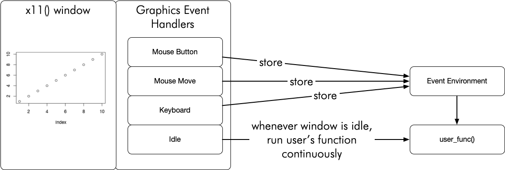

<!-- README.md is generated from README.Rmd. Please edit that file -->

# eventloop 

<!-- badges: start -->


[](https://github.com/coolbutuseless/eventloop/actions)
<!-- badges: end -->

The `{eventloop}` package provides a framework for rendering interactive
graphics and handling mouse+keyboard events from the user at speeds fast
enough to be considered interesting for games and other realtime
applications.

`{eventloop}` is a wrapper around the built-in event handling available
in base R as part of `{grDevices}`, but presents it in a more palatable
format with some enhanced features.

The `{eventloop}` package will:

-   Initiate an `x11()` window with monitoring for keyboard & mouse
    events.  
-   Capture events as they happen such that they will be available to
    the user-supplied function.
-   Coordinate the setup of the user-defined callback function to be run
    continually with access to the latest event information presented as
    the function arguments.
-   Optionally limit the frequency of screen updates by maintaining a
    frame-rate specified by the user.

At each call, the user’s function processes events and updates the
display.

## What’s in the box

-   `run_loop()` takes a user-specified function and calls it
    continuously within an event-driven loop.

## Supported Platforms

| System  | x11() device has ‘onIdle()’ event callback | System supported in {eventloop} |
|:--------|:-------------------------------------------|:--------------------------------|
| macOS   | ✅Yes                                      | ✅Yes                           |
| \*nix   | ✅Yes                                      | ✅Yes                           |
| Windows | ❌ No                                      | ❌ No                           |

#### Notes:

-   windows `x11()` device does not support `onIdle` callback and hence
    this package does not work on windows
-   macOS `x11()` support is via [Xquartz](https://www.xquartz.org/).
    Xquartz may slow to a crawl after running for a while. You will need
    to logout-and-log-back in, or restart your machine to regain full
    speed. This bug may be in Xquartz or how x11() support is
    implemented in macOS - I’m really not sure.

## Installation

Pre-requisites

-   Unix-like systems
    -   R compiled with X11() support
-   macOS
    -   [Xquartz](https://www.xquartz.org/) installed
-   windows
    -   Sorry, but R on windows does not support features needed for
        this package

``` r
# install.package('remotes')
remotes::install_github('coolbutuseless/eventloop')
```

## Example - Basic Drawing app

This is a basic application which lets the user draw in a window using
the mouse.

``` r
library(grid)
library(eventloop)

#~~~~~~~~~~~~~~~~~~~~~~~~~~~~~~~~~~~~~~~~~~~~~~~~~~~~~~~~~~~~~~~~~~~~~~~~~~~~~
# Set up the global variables which store the state of the world
#  'drawing'      = Is the mouse button currently pressed?
#  last_x/last_y  = the last mouse position is manually saved every time
#                 the callback function runs.
#
# These values will be updated manually by the user in the `draw()` function
#~~~~~~~~~~~~~~~~~~~~~~~~~~~~~~~~~~~~~~~~~~~~~~~~~~~~~~~~~~~~~~~~~~~~~~~~~~~~~
drawing <- FALSE
last_x  <- NA
last_y  <- NA

#~~~~~~~~~~~~~~~~~~~~~~~~~~~~~~~~~~~~~~~~~~~~~~~~~~~~~~~~~~~~~~~~~~~~~~~~~~~~~
#' Callback function - 'draw()' 
#'
#' If 'event' is not NULL, then it means that the user interacted with the
#' display.  
#' 
#' The following events are handled by this callback:
#'  - hold mouse to set drawing mode
#'  - releasing the mouse button stops drawing mode
#'  - pressing SPACE clears the canvas
#'  
#' Press ESC to quit.
#' 
#' @param event The event from the graphics device. Is NULL when no event
#'        occurred.  Otherwise has `type` element set to:
#'        `event$type = 'mouse_down'` 
#'               - an event in which a mouse button was pressed
#'               - `event$button` gives the index of the button
#'        `event$type = 'mouse_up'`   
#'               - a mouse button was released
#'        `event$type = 'mouse_move'`   
#'               - mouse was moved 
#'        `event$type = 'key_press'`  
#'               - a key was pressed
#'               - `event$str` String describing which key was pressed. See \code{grDevices::setGraphicsEventHandlers} for more information.
#' @param mouse_x,mouse_y current location of mouse within window in normalised coordinates in the range [0, 1]. If mouse is 
#'        not within window, this will be set to the last available coordinates
#' @param frame_num Current frame number (integer)
#' @param fps_actual,fps_target the curent framerate and the framerate specified
#'        by the user
#' @param dev_width,dev_height the width and height of the output device. Note:
#'        this does not cope well if you resize the window
#' @param ... any extra arguments ignored
#~~~~~~~~~~~~~~~~~~~~~~~~~~~~~~~~~~~~~~~~~~~~~~~~~~~~~~~~~~~~~~~~~~~~~~~~~~~~~
draw <- function(event, mouse_x, mouse_y, ...) {
  
  #~~~~~~~~~~~~~~~~~~~~~~~~~~~~~~~~~~~~~~~~~~~~~~~~~~~~~~~~~~~~~~~~~~~~~~~~~~~
  # Process events
  #~~~~~~~~~~~~~~~~~~~~~~~~~~~~~~~~~~~~~~~~~~~~~~~~~~~~~~~~~~~~~~~~~~~~~~~~~~~
  if (!is.null(event)) {
    if (event$type == 'mouse_down') {
      drawing <<- TRUE
    } else if (event$type == 'mouse_up') {
      drawing <<- FALSE
      last_x  <<- NA
      last_y  <<- NA
    } else if (event$type == 'key_press' && event$str == ' ') {
      grid::grid.rect(gp = gpar(col=NA, fill='white')) # clear screen
    }
  }
  
  #~~~~~~~~~~~~~~~~~~~~~~~~~~~~~~~~~~~~~~~~~~~~~~~~~~~~~~~~~~~~~~~~~~~~~~~~~~~
  # If 'drawing' is currently TRUE, then draw a line from last known 
  # coordinates to current mouse coordinates
  #~~~~~~~~~~~~~~~~~~~~~~~~~~~~~~~~~~~~~~~~~~~~~~~~~~~~~~~~~~~~~~~~~~~~~~~~~~~
  if (drawing) {
    if (!is.na(last_x)) {
      grid::grid.lines(
        x = c(last_x, mouse_x),
        y = c(last_y, mouse_y),
        gp = gpar(col = 'black')
      )
    }
    
    # Keep track of where the mouse was for the next time we draw
    last_x <<- mouse_x
    last_y <<- mouse_y
  }
}


#~~~~~~~~~~~~~~~~~~~~~~~~~~~~~~~~~~~~~~~~~~~~~~~~~~~~~~~~~~~~~~~~~~~~~~~~~~~~~
# Start the event loop. Press ESC to quit.
#~~~~~~~~~~~~~~~~~~~~~~~~~~~~~~~~~~~~~~~~~~~~~~~~~~~~~~~~~~~~~~~~~~~~~~~~~~~~~
eventloop::run_loop(draw, fps_target = NA, double_buffer = TRUE)
```


Notes:

-   Every time the callback function `draw()` is executed from within
    the event loop, it draws a line from the last mouse position to the
    current mouse position.
-   The position of the mouse during the previous call is saved manually
    using global variables.
-   A boolean variable (`drawing`) is used to note whether the mouse
    button is currently pressed or not. Changes to the screen only
    happend if `drawing == TRUE`.

## Gallery of Puzzles, Games + Applications implemented in the vignettes

**Click an image to view the code/vignette**

The linked pages contain videos of realtime screen captures which
illustrate how the interactive nature of these applications work.

All examples are written in plain R using the `{eventloop}` package.

|                                                                                                                                                                            |                                                                                                                                                                                      |
|----------------------------------------------------------------------------------------------------------------------------------------------------------------------------|--------------------------------------------------------------------------------------------------------------------------------------------------------------------------------------|
| [Grid-based drawing <br/>](https://coolbutuseless.github.io/package/eventloop/articles/drawing-grid.html)      | [Line-based drawing <br/>](https://coolbutuseless.github.io/package/eventloop/articles/drawing-lines.html)               |
| [Streaming plot data <br/>](https://coolbutuseless.github.io/package/eventloop/articles/stream-plotting.html) | [Game of Life <br/>](https://coolbutuseless.github.io/package/eventloop/articles/game-of-life.html)                    |
| [Asteroids<br/>](https://coolbutuseless.github.io/package/eventloop/articles/game-asteroids.html)               | [Raycast ‘Wolfenstein’ 3d engine <br/>](https://coolbutuseless.github.io/package/eventloop/articles/game-raycaster.html)   |
| [Wordle <br/>](https://coolbutuseless.github.io/package/eventloop/articles/game-wordle.html)                       | [Interactive Mystery Curves <br/>](https://coolbutuseless.github.io/package/eventloop/articles/verbose-example.html) |
|                                                                                                                                                                            | [Verbose example <br/>](https://coolbutuseless.github.io/package/eventloop/articles/verbose-example.html)                     |

## FAQ

#### Why is Windows not supported?

No graphics device on windows supports the `onIdle` callback, which is
essential to the workings of this package.

The Windows operating system supports the concept of an `onIdle`
callback, but no one has yet written this into the R graphics device on
this platform.

#### Why does this run so slow on macOS sometimes?

Through some unknown combination of factors, after running `x11()`
windows on macOS for some number of times or duration, the system will
slowdown from hundreds-of-frames-per-second to just
ten-frames-per-second.

This feels like a bug in either the `XQuartz()` x11 framework, or it
could be a bug within R in how it interfaces with `XQuartz()`

Note that I have not seen any slowdowns when using `x11()` devices on
Linux machines.

## Tech bits: What is an event loop?

[gameprogrammingpatterns.com](https://www.gameprogrammingpatterns.com/game-loop.html)
defines an event loop (also known as a *game loop*) as follows:

    A game loop runs continuously during gameplay. Each turn of the loop, it 
    processes user input without blocking, updates the game state, and renders 
    the game. It tracks the passage of time to control the rate of gameplay.

## Tech bits: How is the event loop implemented in R?

Graphics windows in R can have *event handlers* attached which instruct
the device to run a function when a certain event occurs.

When a mouse or keyboard event occurs, `{eventloop}` stores the event in
an environment for later access.

When there is no event occuring, another function is called
continuously. This function is the *‘onIdle’ event callback* and is only
available in the `x11()` device on macOS and \*nix.

The `{eventloop}` package orchestrates the events and window information
into arguments to the user-supplied ‘onIdle’ function - calling this
function over and over while the event loop is running.



## Related Software

-   tcl/tk
-   other GUI toolkits
-   rpanel
-   shiny
-   documentation for `grid.locate()`

## Acknowledgements

-   R Core for developing and maintaining the language.
-   CRAN maintainers, for patiently shepherding packages onto CRAN and
    maintaining the repository
