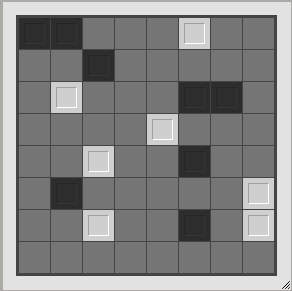
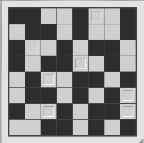

```{r, include = FALSE}
knitr::opts_chunk$set(
  collapse = TRUE,
  comment = "#>"
)
set.seed(1)
```

```{r setup}
library(grid)
library(eventloop)
library(ggplot2)
```

## Introduction

**Unruly** is a puzzle from [Simon Tatham's Puzzle Collection](https://www.chiark.greenend.org.uk/~sgtatham/puzzles/js/unruly.html).

In a square grid of pixels coloured only white or black, fill in any empty 
spaces with a tile such that:

* no three consecutive squares, horizontally or vertically, are the same colour
* each row and column contains the same number of black and white squares

Below is an image of the initial puzzle state for an 8x8 game (left), and
the solution to this puzzle (right).

<div>
  <div style="width:45%; float:left;">
  
  </div>
  <div style="width:45%; float:right;">
  
  </div>
</div>

<div style="clear:both;" />


## What patterns are possible in a row?

Given the constraints, there are a limited number of 8-tile rows that
are valid.

Here I will generate all valid patterns for a sequence of 8 tiles.

These rows of allowable patterns will be the core element used to build
a random valid board state.

```{r}
#~~~~~~~~~~~~~~~~~~~~~~~~~~~~~~~~~~~~~~~~~~~~~~~~~~~~~~~~~~~~~~~~~~~~~~~~~~~~~
# Generate a data.frame of all possible 0/1 values along a row-of-8 values
#~~~~~~~~~~~~~~~~~~~~~~~~~~~~~~~~~~~~~~~~~~~~~~~~~~~~~~~~~~~~~~~~~~~~~~~~~~~~~
b    <- c(0L, 1L)
runs <- expand.grid(b, b, b, b, b, b, b, b)


#~~~~~~~~~~~~~~~~~~~~~~~~~~~~~~~~~~~~~~~~~~~~~~~~~~~~~~~~~~~~~~~~~~~~~~~~~~~~~
# Function to determine if a vector of 8 integers is valid:
#  - cannot be more than 2 values of the same kind in a row
#  - must be four 0s and four 1s in each row
#~~~~~~~~~~~~~~~~~~~~~~~~~~~~~~~~~~~~~~~~~~~~~~~~~~~~~~~~~~~~~~~~~~~~~~~~~~~~~
valid <- function(vec) {
  all(rle(vec)$lengths < 3) &&
    sum(vec == 0L) == 4L
}

#~~~~~~~~~~~~~~~~~~~~~~~~~~~~~~~~~~~~~~~~~~~~~~~~~~~~~~~~~~~~~~~~~~~~~~~~~~~~~
# filter to keep only the valid row patterns for this puzzle
#~~~~~~~~~~~~~~~~~~~~~~~~~~~~~~~~~~~~~~~~~~~~~~~~~~~~~~~~~~~~~~~~~~~~~~~~~~~~~
good <- apply(runs, 1, valid)
runs <- apply(runs[good,], 1, unname, simplify = FALSE)
runs <- unname(runs)
runs <- sample(runs)
```


```{r echo = FALSE}

mat <- do.call(rbind, runs[1:4])
id0 <- as.data.frame(arrayInd(which(mat == 0), dim(mat)))
id1 <- as.data.frame(arrayInd(which(mat == 1), dim(mat)))

id0$V1 <- id0$V1 * 1.2
id1$V1 <- id1$V1 * 1.2

ggplot() + 
  geom_tile(data = id0, aes(V2, V1), fill = 'black', width = 0.95, height = 0.95) + 
  geom_tile(data = id1, aes(V2, V1), fill = 'white', width = 0.95, height = 0.95) + 
  theme_void() +
  theme(plot.background = element_rect(fill = 'grey50')) + 
  coord_equal() + 
  labs(title = "4 of the 34 valid row tilings")
```


## Generate a random board

Using recursion-with-backtracking, I build a random board by adding one of the
valid rows to a board and checking that the puzzle is still in a globally 
valid state.

If ever the addition of a new row of tiles results in an invalid condition,
remove that row and try a different one from the set of 34 valid rows.


```{r}
N <- 8L

#~~~~~~~~~~~~~~~~~~~~~~~~~~~~~~~~~~~~~~~~~~~~~~~~~~~~~~~~~~~~~~~~~~~~~~~~~~~~~
# Check a board is valid
#~~~~~~~~~~~~~~~~~~~~~~~~~~~~~~~~~~~~~~~~~~~~~~~~~~~~~~~~~~~~~~~~~~~~~~~~~~~~~
is_ok <- function(board) {
  all(
    apply(board, 2, function(x) {
      all(rle(x)$lengths < 3) && 
        sum(x == 0L, na.rm = TRUE) < 5L && 
        sum(x == 1L, na.rm = TRUE) < 5L
    })
  )
}


#~~~~~~~~~~~~~~~~~~~~~~~~~~~~~~~~~~~~~~~~~~~~~~~~~~~~~~~~~~~~~~~~~~~~~~~~~~~~~
# Board generation via recurstion-plus-backtracking
# 
# @param board 8x8 matrix of values so var.  Board is NA where values have
#        not yet been set
# @param row which row index are we trying to add to the board?
# @param avail what valid row runs are left?  In this vignette I'm taking 
#        some shortcuts on board generation for the sake of brevity.
#~~~~~~~~~~~~~~~~~~~~~~~~~~~~~~~~~~~~~~~~~~~~~~~~~~~~~~~~~~~~~~~~~~~~~~~~~~~~~
create_board <- function(board, row, avail) {
  if (row > N) {
    if (is_ok(board)) {
      return(board)
    } else {
      return(NULL)
    }
  }
  
  for (i in seq_along(avail)) {
    run  <- avail[[i]]
    test <- board
    test[row,] <- run
    if (is_ok(test)) {
      res <- create_board(test, row + 1L, avail[-i])
      if (!is.null(res)) {
        return(res)
      }
    }
  }
  
  return(NULL)
}


#~~~~~~~~~~~~~~~~~~~~~~~~~~~~~~~~~~~~~~~~~~~~~~~~~~~~~~~~~~~~~~~~~~~~~~~~~~~~~
# Generate an empty board and then create a valid board within it.
#~~~~~~~~~~~~~~~~~~~~~~~~~~~~~~~~~~~~~~~~~~~~~~~~~~~~~~~~~~~~~~~~~~~~~~~~~~~~~
board <- matrix(NA_integer_, N, N)
board <- create_board(board, 1, runs)
```

#### The randomly generated board

```{r echo=FALSE}
board
grid.raster(board, interpolate = FALSE)
```


## Define the game

* `is_valid()` checks a board is a valid state
* `is_solved()` checks the board is in a valid state and the board is complete


```{r}
#~~~~~~~~~~~~~~~~~~~~~~~~~~~~~~~~~~~~~~~~~~~~~~~~~~~~~~~~~~~~~~~~~~~~~~~~~~~~~
# This is a fully featured "Board is in a valid state" check.  
# This check allows for NA elements where the board state has not yet been
# decided
#~~~~~~~~~~~~~~~~~~~~~~~~~~~~~~~~~~~~~~~~~~~~~~~~~~~~~~~~~~~~~~~~~~~~~~~~~~~~~
is_valid <- function(board) {
  board <- round(board)
  all(
    apply(board, 2, function(x) {
      all(rle(x)$lengths < 3) && 
        sum(x == 0L, na.rm = TRUE) < 5L && 
        sum(x == 1L, na.rm = TRUE) < 5L
    })
  ) &&
    all(
      apply(board, 1, function(x) {
        all(rle(x)$lengths < 3) && 
          sum(x == 0L, na.rm = TRUE) < 5L && 
          sum(x == 1L, na.rm = TRUE) < 5L
      })
    )
}

#~~~~~~~~~~~~~~~~~~~~~~~~~~~~~~~~~~~~~~~~~~~~~~~~~~~~~~~~~~~~~~~~~~~~~~~~~~~~~
# If the board is "full" (i.e. there are no NAs), and the board state is 
# valid, then the board has been solved!
#~~~~~~~~~~~~~~~~~~~~~~~~~~~~~~~~~~~~~~~~~~~~~~~~~~~~~~~~~~~~~~~~~~~~~~~~~~~~~
is_solved <- function(board) {
  !anyNA(board) && is_valid(board)
}
```


```{r}
#~~~~~~~~~~~~~~~~~~~~~~~~~~~~~~~~~~~~~~~~~~~~~~~~~~~~~~~~~~~~~~~~~~~~~~~~~~~~~
# Take the known solution and blank 08t 60% of the board
#~~~~~~~~~~~~~~~~~~~~~~~~~~~~~~~~~~~~~~~~~~~~~~~~~~~~~~~~~~~~~~~~~~~~~~~~~~~~~
rem <- sample(N*N, 0.6 * N * N)
init_board <- board
init_board[rem] <- NA

#~~~~~~~~~~~~~~~~~~~~~~~~~~~~~~~~~~~~~~~~~~~~~~~~~~~~~~~~~~~~~~~~~~~~~~~~~~~~~
# The white/black tiles which start on the board are considered unchangeable.
# Create a plotting overlay so the user can tell these initial tiles 
# from other tiles.
#~~~~~~~~~~~~~~~~~~~~~~~~~~~~~~~~~~~~~~~~~~~~~~~~~~~~~~~~~~~~~~~~~~~~~~~~~~~~~
permanent0 <- arrayInd(which(!is.na(init_board) & init_board == 0), c(8, 8)) 
permanent1 <- arrayInd(which(!is.na(init_board) & init_board == 1), c(8, 8)) 

# flip y
permanent0[,1] <- 9 - permanent0[,1]
permanent1[,1] <- 9 - permanent1[,1]

permanent0 <- (permanent0 - 0.5) / 8
permanent1 <- (permanent1 - 0.5) / 8

#~~~~~~~~~~~~~~~~~~~~~~~~~~~~~~~~~~~~~~~~~~~~~~~~~~~~~~~~~~~~~~~~~~~~~~~~~~~~~
# Prep data for the gridlines the help define the board
#~~~~~~~~~~~~~~~~~~~~~~~~~~~~~~~~~~~~~~~~~~~~~~~~~~~~~~~~~~~~~~~~~~~~~~~~~~~~~
ii  <- seq.int(0, 1, length.out = 9)
c1 <- rep(ii, each = 2)
c2 <- rep(c(0, 1), times = 9)
idx <- rep(seq(1:9), each = 2)
```


```{r}

#~~~~~~~~~~~~~~~~~~~~~~~~~~~~~~~~~~~~~~~~~~~~~~~~~~~~~~~~~~~~~~~~~~~~~~~~~~~~~
# Draw a game board
#   'board' must be an 8x8 integer matrix containing only 0L/1L/NA_integer
#~~~~~~~~~~~~~~~~~~~~~~~~~~~~~~~~~~~~~~~~~~~~~~~~~~~~~~~~~~~~~~~~~~~~~~~~~~~~~
draw_board <- function(board) {
  
  # Draw background base board
  grid.rect(gp = gpar(fill = 'grey50', col = 'black', lwd = 5), 
            width = 1, height = 1, default.units = 'snpc')
  
  # Draw the tiles so far
  grid.raster(board, interpolate = FALSE)
  
  # Draw the permanent markers
  grid.rect(
    x = permanent0[,2],
    y = permanent0[,1],
    width  = 0.125 / 4,
    height = 0.125 / 4,
    default.units = 'snpc',
    gp = gpar(col = 'grey10', fill = NA, lwd = 4)
  )
  grid.rect(
    x = permanent1[,2],
    y = permanent1[,1],
    width  = 0.125 / 4,
    height = 0.125 / 4,
    default.units = 'snpc',
    gp = gpar(col = 'grey90', fill = NA, lwd = 4)
  )
  
  
  # Draw Grid
  grid.polyline(c1, c2, id = idx)
  grid.polyline(c2, c1, id = idx)
}


#~~~~~~~~~~~~~~~~~~~~~~~~~~~~~~~~~~~~~~~~~~~~~~~~~~~~~~~~~~~~~~~~~~~~~~~~~~~~~
# Update the game board by attepming to set the location(row, col) to 'value'
#  - if this was a tile in the initial board, it should be considered permanent,
#    so just play a sound and don't actually change teh board.
#  - if the board value was already set to the value specified, do nothing.
#  - if setting the (row,col) to the given value results in a valid board, 
#    then add the current board to the history (so we can undo later if requested)
#~~~~~~~~~~~~~~~~~~~~~~~~~~~~~~~~~~~~~~~~~~~~~~~~~~~~~~~~~~~~~~~~~~~~~~~~~~~~~
update_board <- function(board, row, col, value) {
  
  # Don't let user change initial pieces
  if (!is.na(init_board[row, col])) {
    beepr::beep(1)
    return(board)
  }
  
  value <- as.integer(value == 1)
  
  if (identical(board[row, col], value)) {
    return(board)
  }
  
  new_board <- board
  new_board[row, col] <- value
  if (is_valid(new_board)) {
    history <<- append(history, list(board), after = 0)
    return(new_board)
  } else {
    # Not a valid move. notify user and return
    beepr::beep(10)
    return(board)
  }
  
}
```


## Play the Game

* Click left mouse to add a black tile
* Click right mouse to add a white tile
* Click the middle mouse button to clear the tile space
* Tiles which are draw with an interior square cannot be changed
* I use [{beepr}](https://cran.r-project.org/package=beepr) to play audio when the user attempts an invalid move

Implementation notes:

Because this is a naive implementation of the puzzle:

* There can be multiple valid solutions to each puzzle.
* You may have to guess tiles i.e. there will be situations where there the 
  rules of the puzzle do not point to a valid move.  In such cases, just guess!

```{r eval = FALSE}
#~~~~~~~~~~~~~~~~~~~~~~~~~~~~~~~~~~~~~~~~~~~~~~~~~~~~~~~~~~~~~~~~~~~~~~~~~~~~~
# Global state for the eventloop
#~~~~~~~~~~~~~~~~~~~~~~~~~~~~~~~~~~~~~~~~~~~~~~~~~~~~~~~~~~~~~~~~~~~~~~~~~~~~~
board   <- init_board
init    <- FALSE       # Has the puzzle been started?
solved  <- FALSE       # Has the puzzle been solved?
history <- list()      # Use a simple LIFO queue so the user has unlimited UNDO


#~~~~~~~~~~~~~~~~~~~~~~~~~~~~~~~~~~~~~~~~~~~~~~~~~~~~~~~~~~~~~~~~~~~~~~~~~~~~~
#' Play a game of 'unruly'
#' 
#' Press ESC to quit.
#' 
#' @param event The event from the graphics device. Is NULL when no event
#'        occurred.  Otherwise has `type` element set to:
#'        `event$type = 'mouse_down'` 
#'               - an event in which a mouse button was pressed
#'               - `event$button` gives the index of the button
#'        `event$type = 'mouse_up'`   
#'               - a mouse button was released
#'        `event$type = 'key_press'`  
#'               - a key was pressed
#'               - `event$char` holds the character as string
#'               - `event$int` holds the integer representation
#' @param mouse_x,mouse_y current location of mouse within window. If mouse is 
#'        not within window, this will be set to the last available coordinates
#' @param frame_num integer count of which frame this is
#' @param fps_actual,fps_target the curent framerate and the framerate specified
#'        by the user
#' @param dev_width,dev_height the width and height of the output device. Note:
#'        this does not cope well if you resize the window
#' @param ... any extra arguments ignored
#' #~~~~~~~~~~~~~~~~~~~~~~~~~~~~~~~~~~~~~~~~~~~~~~~~~~~~~~~~~~~~~~~~~~~~~~~~~~
unruly <- function(event, mouse_x, mouse_y, ...) {

  #~~~~~~~~~~~~~~~~~~~~~~~~~~~~~~~~~~~~~~~~~~~~~~~~~~~~~~~~~~~~~~~~~~~~~~~~~~~
  # If this is  first frame then the board *MUST* be drawn
  #~~~~~~~~~~~~~~~~~~~~~~~~~~~~~~~~~~~~~~~~~~~~~~~~~~~~~~~~~~~~~~~~~~~~~~~~~~~  
  if (!init) {
    init <<- TRUE
    draw_board(board)
  }
  
  #~~~~~~~~~~~~~~~~~~~~~~~~~~~~~~~~~~~~~~~~~~~~~~~~~~~~~~~~~~~~~~~~~~~~~~~~~~~  
  # If the puzzle isn't already solved 
  #  - left mouse button = set to to 'black'
  #  - right mouse button = set tile to 'white'
  #  - middle mouse button = clear tile
  #  - 'SPACE', 'u' or 'U' will walk backwards through the history of all
  #    moves made so far
  #~~~~~~~~~~~~~~~~~~~~~~~~~~~~~~~~~~~~~~~~~~~~~~~~~~~~~~~~~~~~~~~~~~~~~~~~~~~  
  if (!solved && !is.null(event)) {
    if (event$type == 'mouse_down') {
      col <-     round(mouse_x * 8 + 0.5)
      row <- 9 - round(mouse_y * 8 + 0.5)
      if (event$button == 0) {
        # left mouse
        board <<- update_board(board, row, col, 0L)
        draw_board(board)
      } else if (event$button == 2) {
        # right mouse
        board <<- update_board(board, row, col, 1L)
        draw_board(board)
      } else if (event$button == 1) {
        # middle
        board <<- update_board(board, row, col, NA_integer_)
        draw_board(board)
      }
      if (is_solved(board)) {
        solved <<- TRUE
        grid.text(label = "Solved!", gp = gpar(col = 'red', cex = 5))
      }
    } else if (event$type == 'key_press') {
      if (event$char %in% c(' ', 'u', 'U')) {
        if (length(history) > 0) { 
          # Pull out the last pushed board from LIFO queue
          board <<- history[[1]]
          history <<- history[-1]
          draw_board(board)
        } else {
          # print("Nothing to undo")
        }
      }
    }
  }
  
}


eventloop::run_loop(unruly, double_buffer = FALSE)
```


 <video controls>
  <source src="images/unruly.mp4" type="video/mp4">
  Your browser does not support the video tag.
</video> 


